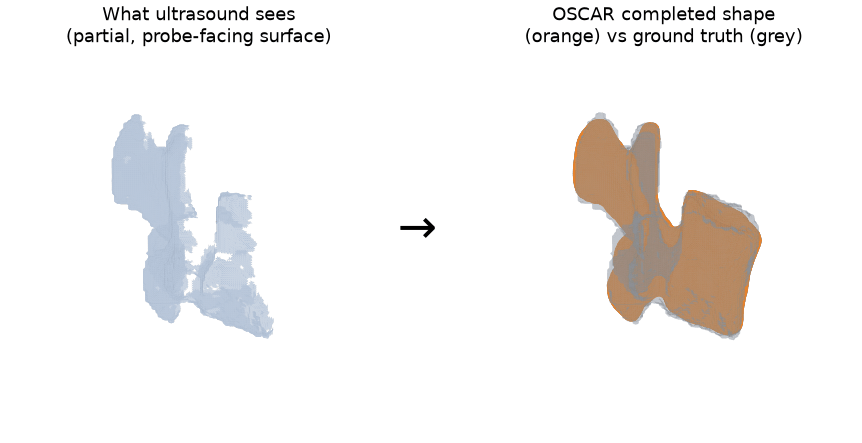
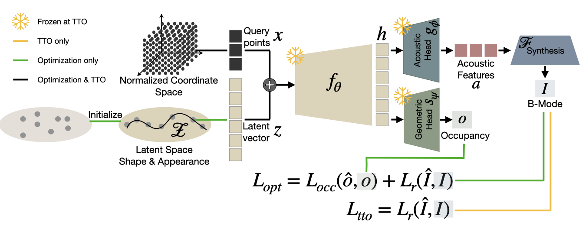
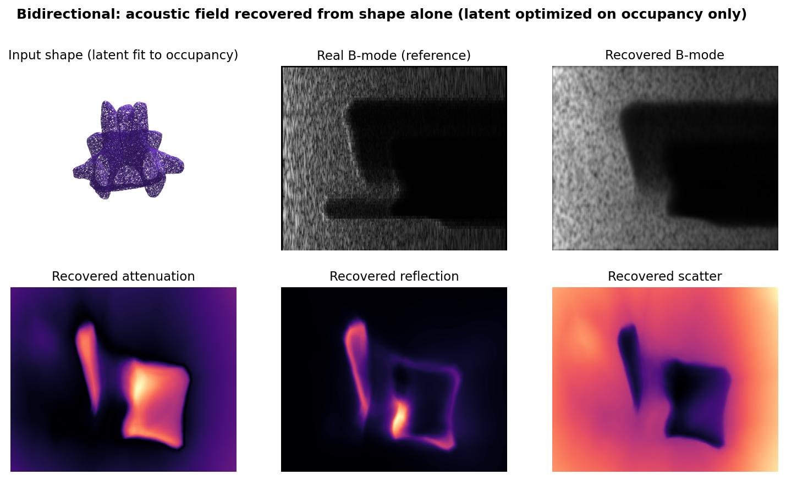

# OSCAR

**Occupancy-based Shape Completion via Acoustic Neural Implicit Representations**

**Magdalena Wysocki**<sup>1,2,\*</sup>, **Kadir Burak Buldu**<sup>1,\*</sup>, **Miruna-Alexandra Gafencu**<sup>1,2,3</sup>, **Benjamin D. Killeen**<sup>1,2</sup>, **Mohammad Farid Azampour**<sup>1,2</sup>, **Nassir Navab**<sup>1,2</sup>

<sup>1</sup> Computer Aided Medical Procedures (CAMP), Technical University of Munich &nbsp;·&nbsp; <sup>2</sup> Munich Center for Machine Learning (MCML) &nbsp;·&nbsp; <sup>3</sup> Konrad Zuse School of Excellence in Reliable AI (relAI), Germany\
<sup>\*</sup> Equal contribution

[📄 Paper (arXiv)](https://arxiv.org/abs/2603.08279) &nbsp;·&nbsp; [🌐 Project page](https://magdalena-wysocki.github.io/Oscar/)

This repository is the code release for the OSCAR paper, accepted to
**MICCAI 2026**. It contains the training, test-time optimization,
supporting data, and evaluation utilities.

Ultrasound images only the probe-facing surface of a bone; everything behind the
first strong reflector is shadowed. OSCAR completes the full 3D shape from that
partial observation:



:mag: We are open to collaborations on the topics related to 3D reconstruction. 
Feel free to reach us out!

## Method

OSCAR completes 3D anatomical shape directly from B-mode ultrasound, with no
annotation at inference. A shared encoder maps the input to a latent code $z$,
which two heads decode:



- **Occupancy head** $o(x \mid z)$ — predicts occupancy at query point $x$; the
  shape is the occupied region $\{x : o(x \mid z) > \tau\}$, and its boundary is
  the iso-surface $\{x : o(x \mid z) = \tau\}$ (extracted as the mesh).
- **Acoustic head** — models the physics of the beam (attenuation and
  transmission) and is supervised directly from the B-mode frames.

The anatomical prior lives in the shared latent space $p(z)$, trained jointly on
image appearance and shape. At inference a
single shape is recovered by MAP optimization over $z$ (no sampling): the latent
is optimized so that the acoustically rendered frames match the observed B-mode.

Because appearance and shape share the same latent, the mapping is
**bidirectional**: the acoustic parameters can be recovered from shape alone.
Given an inferred anatomy, the model reconstructs a plausible acoustic field,
enabling novel-view synthesis of B-mode images for a known shape.

### Physics-aware rendering

The acoustic field is rendered to B-mode with the differentiable formulation
from ultrasound NeRFs. Each transducer ray $r(t) = o + t\,d$ is a full 1D
scanline. The transmission $\mathcal{T}(t)$ — the acoustic energy left at depth
$t$ — attenuates with the predicted attenuation $\mu$ and reflection $\beta$,
enforcing energy conservation:

$$\mathcal{T}(t) = \exp\!\left(-\int_0^t \big(\mu(r(s)) + \beta(r(s))\big)\,ds\right)$$

and the expected intensity is the local reflection and scatter, modulated by the
remaining energy:

$$\hat{I}(r(t)) = \mathcal{T}(t)\,\big(\beta(r(t)) + \sigma(r(t))\big)$$

**Shadowed regions carry no information, so the prior — not the image —
completes the shape there.** At a strong reflector such as bone, $\mu + \beta$
spikes and $\mathcal{T}(t)$ decays to ~0 beyond it. Because intensity is scaled
by $\mathcal{T}(t)$, both the rendered signal *and its gradient* vanish in the
acoustic shadow. This has a useful consequence:

- The shadowed region contributes **nothing** to the loss — no anatomy is ever
  inferred from pixels behind a reflector.
- With no image evidence to fit there, the occupancy head has only the **latent
  prior** to rely on, and it is the prior that fills in the occluded geometry.

So occluded shape is completed **implicitly**: the physics simply zeros out the
shadow, and the learned prior does the completion — the model never needs shadow
masks or any explicit signal telling it where the occlusions are.

## Repository layout

```
unerf_config.py        Argument / config parser (shared by both entry points)
model.py               OSCAR network (coordinate MLP)
rendering.py           Differentiable ultrasound renderer (attenuation/reflection/scatter)
nerf_utils.py          Embedding, network construction, render entry point, losses, regularizers
data_utils.py          UltrasoundLazyDataset (memory-mapped data loader)
validation_utils.py    3D metrics (Dice/HD95) + validation calibration + history tracker
mesh_utils.py          Occupancy -> mesh export + mesh preview rendering
train.py               Train OSCAR
test_time_optimize.py  Test-time latent optimization on an unseen subject
configs/
  oscar.txt            Ready-to-run config for the released 132 / 10 / 10 split
  train_oscar.txt      Training config template (bring your own data)
  optimize_oscar.txt   Test-time optimization config template
scripts/
  create_poses_labels.py   Preprocess: derive per-pixel 3D points from poses.npy
  create_gt_volume.py      Build the GT 3D occupancy volume (for metrics)
  augment_data.py          Optional training augmentation (rotate / translate)
  aggregate_results.py     Aggregate Dice/HD95 across runs into a table
  visualize_mesh.py        Render front/side/top previews of a predicted mesh
```

## Installation

```bash
conda env create -f environment.yml      # creates the "oscar" env
conda activate oscar
# or:  pip install -r requirements.txt
```
## Data & pretrained model

The dataset (~11 GB) and the pretrained OSCAR checkpoint are hosted on Google Drive:

**https://drive.google.com/drive/folders/1Tyc3wGm3Oytn1DfkxUANFS18l_MqVa90?usp=sharing**

```
OSCAR/
  data/         152 sweeps (132 train / 10 val / 10 test) — see data/README.md
  checkpoints/  oscar_best_model.tar  (pretrained OSCAR weights + latent codes)
```

Download both into the repository root (so you have `./data` and `./checkpoints`),
then run preprocessing once to rebuild the derived files (next section):

```bash
python scripts/preprocess_all.py --data_root ./data
```

## Data layout and pre-processing

```
data/<subject>/
  poses.npy             [N, 4, 4]   float   probe poses (tracking + registration baked in, mm)
  images.npy            [N, H, W]   uint8   B-mode frames (0-255)
  masks_gt.npy          [N, H, W]   {0,1}   per-frame occupancy mask (training supervision)
```
To generate evaluation data run pre-processing scripts

```
  poses_labels.npy      [N, W, H, 3] float  per-pixel 3D coords in [0,1]   <- create_poses_labels.py
  point_cloud_min_max.txt                   physical extent               <- create_poses_labels.py
  gt_volume.npy         [G, G, G]   uint8   GT 3D occupancy volume         <- create_gt_volume.py
```
(Translation-augmented sweeps ship a tiny `transform.npy`, ~48 B, that the
scripts apply automatically.)


### Preprocessing

```bash
# 1) per-pixel 3D points from poses (writes poses_labels.npy + point_cloud_min_max.txt)
python scripts/create_poses_labels.py --data_dir ./data/<subject>

# 2) GT 3D occupancy volume for metrics (writes gt_volume.npy)
python scripts/create_gt_volume.py --data_dir ./data/<subject>
```

Run both for every training, validation and test subject. The defaults
(`--probe_depth 110 --probe_width 60`) match the released data; change them only
if your sweeps used a different probe geometry.

### Augmentation (optional, training only)

Expand the training set with rotated/translated copies of a subject (after its
`poses_labels.npy` exists), then rebuild that copy's GT volume:

```bash
python scripts/augment_data.py --mode rotate    --src ./data/<subj> --out ./data_aug/<subj>_rot   --max_angle 10
python scripts/augment_data.py --mode translate --src ./data/<subj> --out ./data_aug/<subj>_trans --ratio 0.075
python scripts/create_gt_volume.py --data_dir ./data_aug/<subj>_rot
```

The released training set already includes these augmentations: 33 rotation-augmented
and 66 translation-augmented sweeps (the latter each carry a ~48 B `transform.npy`).
You only need this step to add further augmentations of your own.

## Training

For the released dataset, `configs/oscar.txt` already lists the full 132-subject
`datadir` and 10-subject `val_datadir`, so you can train directly:

```bash
python train.py --config configs/oscar.txt
```

To use your own data, edit `configs/train_oscar.txt` to point `datadir` (training
subjects) and `val_datadir` (validation subjects) at your folders instead.

Training optimizes the network weights and all subject latent codes. At each
epoch boundary it calibrates a fresh latent on the validation subjects and
records 3D Dice/HD95; the best model is saved to
`logs_train/<expname>/best_model.tar` and the selected number of test-time
steps is stored in `logs_train/<expname>/validation_history.json`. Training
resumes automatically from the latest checkpoint in the experiment folder.

## Test-time optimization (inference on an unseen subject)

```bash
# With the released pretrained checkpoint (optimize_oscar.txt already sets
# latent_optimize_ckpt_path = ./checkpoints/oscar_best_model.tar):
python test_time_optimize.py --config configs/optimize_oscar.txt \
    --datadir ./data/<test_subject>

# ...or with a checkpoint you trained yourself:
python test_time_optimize.py --config configs/optimize_oscar.txt \
    --datadir ./data/<test_subject> \
    --latent_optimize_ckpt_path ./logs_train/<expname>/best_model.tar
```

The network is frozen and a single latent code is optimized to reconstruct the
test subject's frames. The step count is `n_iters` from the config (6000) unless a
`validation_history.json` sits next to the checkpoint, in which case its
`best_cal_steps` is used; a **negative** `--n_iters` forces a fixed budget
(e.g. `--n_iters -6000` runs exactly 6000 steps). Outputs in
`logs_test/<timestamped_expname>/`:

```
test_results.json                 final Dice/HD95, settings, optimized latent
test_time_metrics_by_epoch.json   metric trajectory over optimization
mesh_completed.obj                final predicted occupancy mesh
mesh_completed_occ.npy            thresholded occupancy grid
mesh_completed_prob.npy           probability occupancy grid
mesh_completed_view_*.png         front / side / top previews
```

## Results

On the same sweeps, OSCAR is compared against two prior shape-completion
methods: **SITD** (Shape Completion in the Dark [[1]](#references)) and
**NISF** (Neural Implicit Segmentation Functions [[2]](#references)).
Reconstructions from the simulation test set:

<div align="center">
  <video src="docs/assets/figures/comparison.mp4" controls muted loop playsinline width="640"></video>
</div>

> If the video does not play inline, [watch it here](docs/assets/figures/comparison.mp4).

Metrics on the simulation and phantom test sets (↓ lower is
better, ↑ higher is better):

| Domain | Method | Label | HD95 (mm) ↓ | Chamfer ↓ | F1 ↑ |
|--------|--------|-------|-------------|-----------|------|
| Sim.   | SITD   | ✓ | 5.93 ± 0.94 | 119.87 ± 17.04 | 0.21 ± 0.04 |
| Sim.   | NISF   | ✗ | 3.03 ± 0.92 | 88.38 ± 14.43  | 0.33 ± 0.05 |
| Sim.   | $\textcolor{#1d4ed8}{\textbf{OSCAR}}$ | ✗ | **1.17 ± 0.38** | **56.57 ± 6.64** | **0.54 ± 0.06** |
| Phan.  | SITD   | ✓ | 7.17 ± 1.05 | 104.66 ± 20.50 | 0.23 ± 0.07 |
| Phan.  | NISF   | ✗ | 8.61 ± 2.85 | 146.98 ± 22.57 | 0.23 ± 0.01 |
| Phan.  | $\textcolor{#1d4ed8}{\textbf{OSCAR}}$ | ✗ | 7.46 ± 3.41 | 105.34 ± 20.99 | **0.27 ± 0.05** |

### Bidirectional shape ↔ acoustics

The shared latent runs both ways: fitting it to occupancy only (shape) recovers
a plausible acoustic field, so B-mode frames and acoustic/transmission maps can
be synthesized for a known shape.



Latent fit to occupancy only → recovered B-mode and acoustic maps for a frame
(real B-mode shown for reference).

## Evaluation and visualization

```bash
# Aggregate Dice/HD95 across many runs into a table (+ optional CSV)
python scripts/aggregate_results.py ./logs_test --csv results.csv

# Render previews from a mesh or an occupancy grid
python scripts/visualize_mesh.py logs_test/<run>/mesh_completed.obj
python scripts/visualize_mesh.py logs_test/<run>/mesh_completed_prob.npy --iso 0.5
```

## Notes

- `i_embed = -1` (identity encoding) is the configuration used for OSCAR.
- `output_ch = 4` corresponds to three acoustic channels (attenuation,
  reflection, scatter) plus one occupancy channel; it must match between
  training and test-time optimization.

## References

<a name="references"></a>

1. Gafencu, M.-A., Velikova, Y., Saleh, M., Ungi, T., Navab, N., Wendler, T.,
   Azampour, M. F. *Shape Completion in the Dark: Completing Vertebrae
   Morphology from 3D Ultrasound.* IJCARS, 2024. arXiv:2404.07668.
2. Stolt-Ansó, N., McGinnis, J., Pan, J., Hammernik, K., Rueckert, D.
   *NISF: Neural Implicit Segmentation Functions.* MICCAI 2023.
   doi:10.1007/978-3-031-43901-8_70.

## Acknowledgements

The differentiable ultrasound renderer builds on Ultra-NeRF
(https://github.com/magdalena-wysocki/ultra-nerf); the implicit-network code
derives from nerf-pytorch (https://github.com/yenchenlin/nerf-pytorch). See
[ACKNOWLEDGEMENTS](ACKNOWLEDGEMENTS) for third-party licenses.

## Maintainer

Developed and maintained by Kadir Burak Buldu ([@buldubu](https://github.com/buldubu)) and Magdalena Wysocki ([@magdalena-wysocki](https://github.com/magdalena-wysocki)).

## License

Released under the MIT License — see [LICENSE](LICENSE).

## Citation
If you find the code useful, we would be grateful if you cite the corresponding paper.

```bibtex
@article{wysocki2026oscar,
  title={Oscar: Occupancy-based shape completion via acoustic neural implicit representations},
  author={Wysocki, Magdalena and Buldu, Kadir Burak and Gafencu, Miruna-Alexandra and Killeen, Benjamin D. and Azampour, Mohammad Farid and Navab, Nassir},
  journal={arXiv preprint arXiv:2603.08279},
  year={2026}
}
```
## LLM-use Disclaimer
We used Claude Code to clean and document the repository.